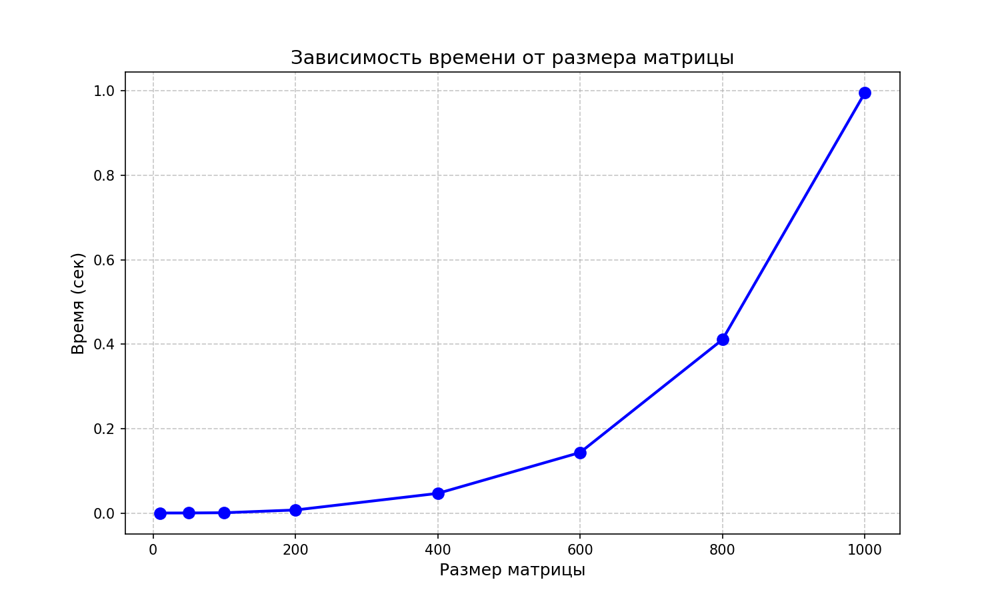
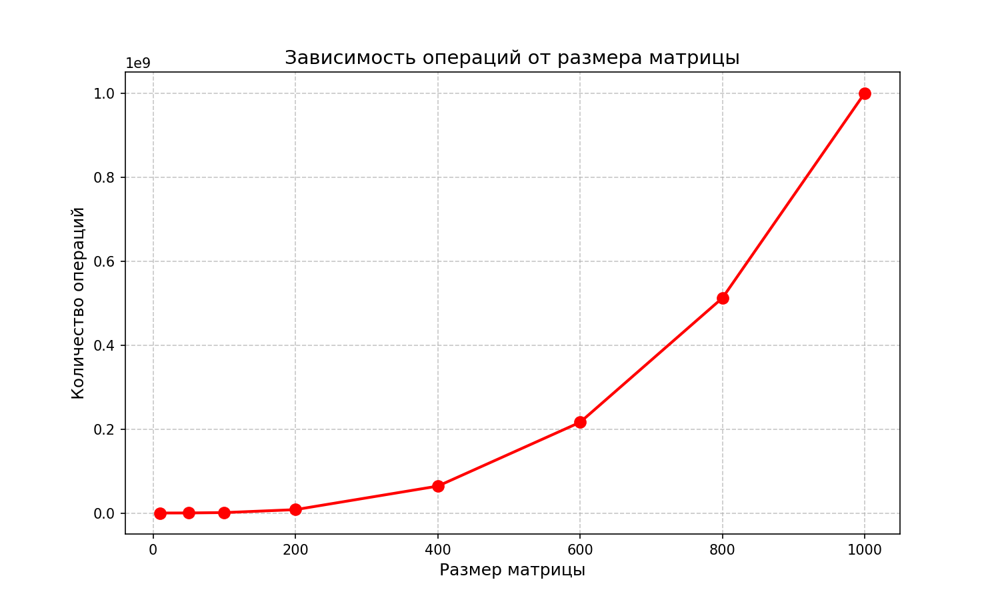

# Лабораторная работа №1

## Задание
Написать программу на C++ для умножения двух квадратных матриц.

## Студент
Шуреев К. 6313 3 курс

## Запуск
```bash
python3 benchmarks.py

### Результаты тестов

| Размер | Время (сек) | Операций | Статус |
|--------|-------------|----------|--------|
| 10 | 0.000001 | 1 000 | ✅ PASSED |
| 50 | 0.000071 | 125 000 | ✅ PASSED |
| 100 | 0.000632 | 1 000 000 | ✅ PASSED |
| 500 | 0.113337 | 125 000 000 | ✅ PASSED |
| 1000 | 1.704138 | 1 000 000 000 | ✅ PASSED |

### График времени



### График операций



##Вывод

В ходе выполнения лабораторной работы разработана программа для умножения квадратных матриц. Эксперименты подтвердили сложность O(n³). Для матрицы 1000×1000 выполнен 1 миллиард операций за 1.7 секунды. Все тесты пройдены успешно.
